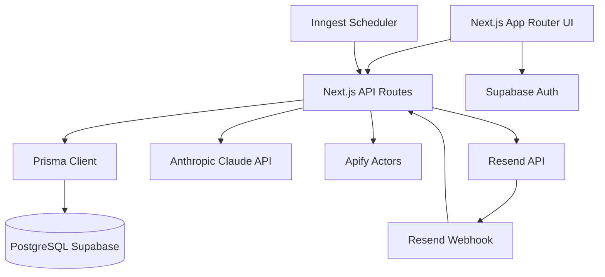
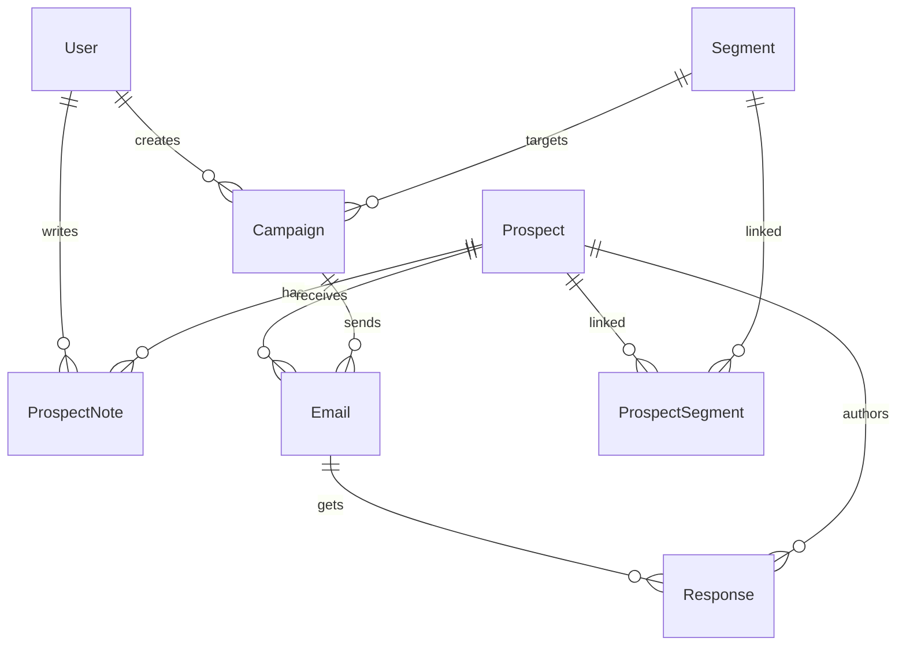
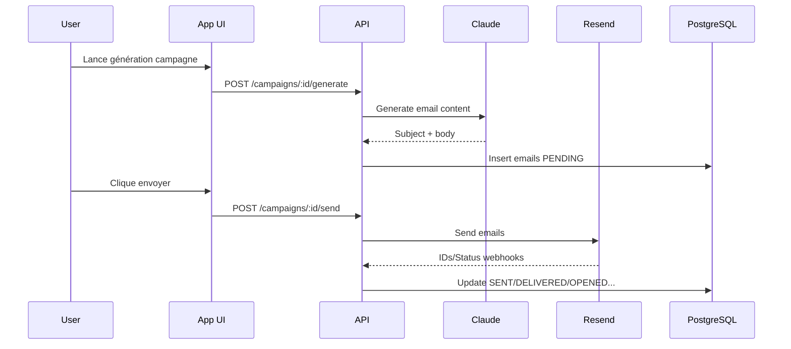

# SCPB Commercial AI — Contexte complet

## 1. Vue d'ensemble
- SCPB Commercial AI est une plateforme web de prospection commerciale B2B orientée secteur cacao et dérivés.
- Le projet centralise le cycle complet: acquisition de leads (scraping), qualification, segmentation, génération d'emails IA, envoi, relances et suivi.
- Le problème résolu est l'automatisation contrôlée d'une prospection ciblée, avec scoring et cadence d'envoi pour préserver la délivrabilité.
- Utilisateurs cibles: équipe commerciale SCPB (admin, responsables, assistants, direction).
- État actuel: MVP avancé en développement actif (build OK, fonctionnalités principales branchées, quelques limitations techniques identifiées).

## 2. Stack technique
- Langage: TypeScript
- Frontend: Next.js 16.2.3 (App Router), React 19.2.4
- UI: Tailwind CSS v4, shadcn/ui (Base UI), lucide-react, sonner
- Graphiques: recharts
- Validation: zod
- Parsing fichiers: papaparse, xlsx
- Base de données: PostgreSQL (Supabase) + Prisma 7.7.0 + @prisma/adapter-pg
- Auth: Supabase Auth (via @supabase/ssr + @supabase/supabase-js)
- IA: Anthropic SDK (@anthropic-ai/sdk)
- Scraping: Apify (apify-client)
- Emailing: Resend
- Jobs/automation: Inngest
- Déploiement/hébergement ciblé: Vercel (app), Supabase (DB/Auth), Inngest Cloud, Resend, Apify

## 3. Architecture



- Couches:
  - Frontend: pages dashboard + login + composants UI.
  - Backend: API routes Next.js.
  - Data: Prisma + PostgreSQL Supabase.
  - Services externes: Supabase, Claude, Apify, Resend, Inngest.
- Pattern dominant: monolithe modulaire (frontend + backend dans le même projet Next.js).
- Flux principaux:
  - Scraping -> enrichissement -> scoring -> insertion prospects.
  - Segment/campagne -> génération IA -> email pending -> envoi batch -> statuts.
  - Cron Inngest -> relances automatiques.

## 4. Structure des dossiers

```txt
agent-commercial/
├─ src/
│  ├─ app/
│  │  ├─ (dashboard)/                # UI métier (dashboard, prospects, campagnes, etc.)
│  │  ├─ login/                      # Auth UI
│  │  ├─ api/                        # Endpoints backend
│  │  │  ├─ prospects/               # CRUD + import
│  │  │  ├─ scraping/                # Jobs scraping
│  │  │  ├─ segments/                # Segmentation
│  │  │  ├─ campaigns/               # Campagnes + génération + envoi
│  │  │  ├─ sending/                 # Stats + batch global
│  │  │  ├─ responses/               # Lecture réponses
│  │  │  ├─ settings/                # Paramètres + user par défaut
│  │  │  ├─ ai/                      # Génération IA ad-hoc
│  │  │  ├─ webhooks/resend/         # Webhook statuts email
│  │  │  └─ inngest/                 # Handler Inngest
│  ├─ components/
│  │  ├─ ui/                         # Composants design system
│  │  ├─ layout/                     # Header, sidebar, page-title
│  │  └─ prospects/                  # Vue prospects client-side
│  ├─ lib/
│  │  ├─ prisma.ts                   # Client Prisma
│  │  ├─ supabase/                   # Clients/middleware Supabase
│  │  ├─ claude.ts                   # Génération + classification IA
│  │  ├─ apify.ts                    # Intégration scraping Apify
│  │  ├─ resend.ts                   # Envoi Resend
│  │  ├─ scoring.ts                  # Scoring leads
│  │  ├─ dedup.ts                    # Déduplication
│  │  └─ email-extractor.ts          # Extraction d'emails
│  ├─ inngest/functions.ts           # Jobs planifiés
│  └─ generated/prisma/              # Client Prisma généré
├─ prisma/schema.prisma              # Schéma DB
├─ data/cocoa_keywords_scraping.csv  # Base keywords scraping
├─ docs/                             # Documents cahier des charges
├─ README.md
└─ PROJECT_CONTEXT.md
```

## 5. Schéma de base de données

### Tables et champs (résumé)
- `users`: `id`, `email` (unique), `name`, `role`, `avatarUrl`, timestamps
- `prospects`: société/contact/email(unique)/pays/secteur/type/produit/statut/langue/priorité/score/website/source/notes/lastContactedAt + timestamps
- `segments`: `id`, `name`, `description`, `filters` (JSON), timestamps
- `prospect_segments`: table pivot (`prospectId`, `segmentId`) PK composite
- `campaigns`: nom, segment, produit, langue, ton, statut, config relances/quotas, métriques (sent/open/reply/...) + timestamps
- `emails`: campagne/prospect/subject/body/statut/type/resendId + timestamps d'événements
- `responses`: lien email+prospect, contenu, classification, suggestedReply, processedAt, createdAt
- `prospect_notes`: notes liées à prospect + auteur
- `scraping_jobs`: keywords/countries/categories JSON, statut, runId, résultats, erreurs, timestamps
- `email_templates`: templates réutilisables
- `app_settings`: singleton `id=default`, limites, signature, infos société

### Relations
- `User` 1-* `Campaign`
- `User` 1-* `ProspectNote`
- `Prospect` 1-* `Email`
- `Prospect` 1-* `Response`
- `Campaign` 1-* `Email`
- `Email` 1-* `Response`
- `Prospect` *-* `Segment` via `ProspectSegment`

### ER diagram


### Index notables
- `prospects`: index sur `country`, `status`, `score`, `sector`
- `campaigns`: index sur `status`
- `emails`: index sur `campaignId`, `prospectId`, `status`, `scheduledFor`
- `responses`: index sur `classification`
- `scraping_jobs`: index sur `status`

## 6. API / Endpoints

- `GET /api/prospects` - Liste filtrée (`status`, `country`, `search`, pagination)
- `POST /api/prospects` - Création prospect (validation zod)
- `POST /api/prospects/import` - Import CSV (`file` form-data)
- `GET /api/segments` - Liste segments
- `POST /api/segments` - Création segment + auto-link prospects
- `GET /api/campaigns` - Liste campagnes
- `POST /api/campaigns` - Création campagne
- `GET /api/campaigns/:id` - Détail campagne
- `PATCH /api/campaigns/:id` - Mise à jour campagne
- `POST /api/campaigns/:id/generate` - Génération emails IA
- `POST /api/campaigns/:id/send` - Envoi batch campagne
- `GET /api/scraping` - Liste jobs scraping
- `POST /api/scraping` - Lancement scraping
- `POST /api/ai/generate` - Génération email ad-hoc
- `GET /api/sending/stats` - KPIs d’envoi
- `POST /api/sending/batch` - Envoi batch global
- `GET /api/responses` - Liste réponses classifiées
- `GET /api/settings` - Lecture settings
- `PUT /api/settings` - Upsert settings
- `POST /api/settings/default-user` - Création utilisateur par défaut Supabase + tentative sync DB locale
- `POST /api/webhooks/resend` - Ingestion statuts Resend
- `GET|POST|PUT /api/inngest` - Endpoint runtime Inngest

Authentification:
- Middleware Supabase protège la majorité des routes (redirection `/login` si non connecté).
- Aucune gestion RBAC stricte par endpoint pour l’instant.

## 7. Fonctionnalités implémentées

- Authentification login/signup Supabase (`src/app/login/page.tsx`)
- Dashboard KPI et charts (`src/app/(dashboard)/page.tsx`, `src/components/dashboard/charts.tsx`)
- Gestion prospects (liste, filtres, ajout, import/export CSV) (`src/components/prospects/prospects-client.tsx`, `src/app/api/prospects/*`)
- Segmentation (custom + presets) (`src/app/(dashboard)/segments/page.tsx`, `src/app/api/segments/route.ts`)
- Scraping Apify + enrichissement + scoring + dedup (`src/app/api/scraping/route.ts`, `src/lib/apify.ts`, `src/lib/scoring.ts`, `src/lib/dedup.ts`)
- Campagnes (CRUD de base, détail, génération IA, envoi) (`src/app/(dashboard)/campaigns/*`, `src/app/api/campaigns/*`)
- Agent IA ad-hoc pour email (`src/app/(dashboard)/ai/page.tsx`, `src/app/api/ai/generate/route.ts`)
- Envoi batch et quotas (`src/app/(dashboard)/sending/page.tsx`, `src/app/api/sending/*`)
- Webhook Resend (statuts delivered/opened/clicked/bounced) (`src/app/api/webhooks/resend/route.ts`)
- Jobs planifiés Inngest (relances + envoi) (`src/inngest/functions.ts`, `src/app/api/inngest/route.ts`)
- Paramètres globaux + création utilisateur par défaut (`src/app/(dashboard)/settings/page.tsx`, `src/app/api/settings/*`)
- Refonte UI premium globale (cards/inputs/tables, login premium, typographie Inter, headers harmonisés)

## 8. Workflows clés

### 8.1 Scraping prospect
1. User configure les filtres sur `/scraping`
2. `POST /api/scraping` crée un `scraping_job`
3. Appel Apify Google Maps + polling
4. Enrichissement contact info + email extraction
5. Scoring + déduplication
6. Insert prospects en DB

### 8.2 Campagne email
1. Création campagne `/campaigns/new`
2. Génération IA `/api/campaigns/:id/generate`
3. Envoi batch `/api/campaigns/:id/send` ou `/api/sending/batch`
4. Webhook Resend met à jour statuts

### 8.3 Relances automatiques
1. Cron Inngest détecte emails initiaux non répondus
2. Génère follow-up par Claude
3. Place les relances en `PENDING`
4. Job d’envoi en cadence expédie les relances



## 9. Variables d'environnement

- `NEXT_PUBLIC_SUPABASE_URL`: URL publique Supabase
- `NEXT_PUBLIC_SUPABASE_ANON_KEY`: clé anonyme Supabase
- `SUPABASE_SERVICE_ROLE_KEY`: clé admin Supabase (server-only)
- `DATABASE_URL`: connexion PostgreSQL (Prisma)
- `ANTHROPIC_API_KEY`: clé API Claude
- `RESEND_API_KEY`: clé API Resend
- `RESEND_FROM_EMAIL`: expéditeur par défaut
- `APIFY_API_TOKEN`: token Apify
- `INNGEST_EVENT_KEY`: clé event Inngest
- `INNGEST_SIGNING_KEY`: clé signature Inngest
- `NEXT_PUBLIC_APP_URL`: URL publique app

## 10. Commandes utiles

```bash
npm install
npm run dev
npm run build
npm run lint

npx prisma generate
npx prisma migrate dev --name init
npx prisma migrate deploy
npx prisma studio
```

## 11. Conventions de code

- Style: TypeScript + composants React fonctionnels + hooks
- UI: design system `src/components/ui`, classes Tailwind utilitaires
- API: conventions Next Route Handlers (`route.ts`)
- DB: schéma Prisma unique `prisma/schema.prisma`
- Linting: ESLint (`eslint.config.mjs`)
- Conventions de commits: non définies explicitement dans le repo

## 12. Bugs connus & limitations actuelles

- Middleware global peut interférer avec certains callbacks machine-to-machine (`/api/webhooks/resend`, `/api/inngest`) selon contexte auth.
- Validation incomplète sur certains endpoints (`PATCH /api/campaigns/:id` accepte payload libre).
- `replyCount` campagne non incrémenté explicitement dans la logique actuelle.
- `classifyResponse` existe mais n’est pas branché à un pipeline d’ingestion complet des emails entrants.
- `prisma` peut devenir indisponible si `DATABASE_URL` absent (warning runtime, erreurs possibles sur endpoints DB).
- Création utilisateur par défaut possible depuis settings sans contrôle RBAC explicite (sécurité à renforcer).

## 13. Historique des changements (Changelog)

- [2026-04-13] - [DB] - Ajout création utilisateur par défaut via settings (`/api/settings/default-user`) et section UI dédiée - Fichiers: `src/app/(dashboard)/settings/page.tsx`, `src/app/api/settings/default-user/route.ts`
- [2026-04-13] - [REFACTOR] - Correction hydration error liée aux boutons imbriqués (dropdown/dialog triggers) - Fichiers: `src/components/layout/header.tsx`, `src/app/(dashboard)/segments/page.tsx`, `src/components/prospects/prospects-client.tsx`, `src/app/(dashboard)/responses/page.tsx`
- [2026-04-13] - [REFACTOR] - Refonte visuelle premium globale (cards/inputs/tables, headers unifiés) - Fichiers: `src/components/ui/card.tsx`, `src/components/ui/input.tsx`, `src/components/ui/table.tsx`, `src/components/layout/page-title.tsx`, pages dashboard/login
- [2026-04-13] - [REFACTOR] - Refonte premium login/signup (switch mode, microcopy, branding) - Fichiers: `src/app/login/page.tsx`
- [2026-04-13] - [FEATURE] - Renaming produit vers SCPB Commercial AI et harmonisation branding UI - Fichiers: `src/app/layout.tsx`, `src/components/layout/sidebar.tsx`, `src/app/login/page.tsx`
- [2026-04-13] - [FEATURE] - Documentation complète README technique (install, config, déploiement) - Fichier: `README.md`
- [2026-04-13] - [FEATURE] - Implémentation initiale plateforme (dashboard, prospects, segments, scraping, campagnes, IA, sending, settings, API, schéma Prisma, jobs Inngest) - Fichiers: projet complet

## 14. TODO / Roadmap

- Ajouter contrôle RBAC strict (admin-only) sur endpoints sensibles.
- Exclure explicitement `/api/webhooks/resend` et `/api/inngest` du middleware auth.
- Brancher pipeline complet de gestion des réponses entrantes + incrément `replyCount`.
- Ajouter tests automatisés (API + intégration UI).
- Ajouter observabilité (Sentry, logs structurés, métriques de jobs).
- Ajouter onboarding guidé pour configuration initiale (`.env`, base, services externes).

