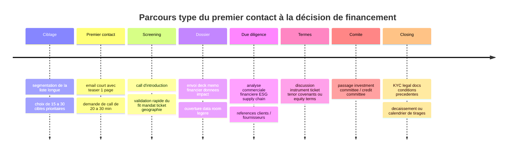

# Cartographie des financeurs pour les chaînes de valeur cacao et café

## Résumé exécutif

Le capital le plus actionnable pour un fournisseur cacao/café, une coopérative exportatrice, un transformateur léger ou une startup agri-commodities ne se trouve pas d’abord chez les grands bailleurs généralistes, mais dans une couche intermédiaire d’acteurs spécialisés du trade finance, du blended finance et de l’impact agri-SME. Les fenêtres les plus adaptées aux besoins réels du terrain se concentrent surtout entre environ 100 k$ et 5 M$, avec des acteurs comme entity["organization","Root Capital","agri impact lender"], entity["organization","Alterfin","impact cooperative lender"], entity["organization","Common Fund for Commodities","commodity impact funder"], entity["organization","Acumen Resilient Agriculture Fund","climate ag fund"], entity["organization","The Yield Lab","agrifood vc network"] ou entity["organization","Sahel Capital","africa agrifood investor"], alors que les DFI directes deviennent vite plus lourdes, plus lentes et plus institutionnelles. citeturn35search12turn35search2turn41search1turn16search11turn22search2turn18search7turn24search8turn27search7

Pour un **supplier / exportateur / processeur cacao-café**, la première vague d’approche devrait généralement être : Root Capital, Alterfin, CFC, entity["organization","IDH Farmfit Fund","smallholder blended fund"], entity["organization","Oikocredit","impact cooperative investor"], entity["organization","Shared Interest","fair trade finance"] et Sahel Capital. Pour un besoin plus structuré, institutionnel ou transfrontalier, la deuxième vague est plutôt composée de entity["organization","IFC","world bank group member"], entity["organization","TDB Group","african trade bank"] et entity["organization","Proparco","french dfi"]. citeturn35search16turn35search2turn41search4turn40search1turn40search7turn35search19turn18search6turn27search7turn42search0turn24search8

Pour une **startup agri / fintech / traceability / climat** liée au cacao ou au café, le terrain le plus crédible est celui de entity["organization","Omnivore","agritech vc"], entity["organization","Novastar Ventures","africa vc"], The Yield Lab, entity["organization","Astanor Ventures","agrifood vc"], entity["organization","AgFunder","agrifood deeptech vc"], ARAF, ainsi que certains family offices et investisseurs catalytiques comme entity["organization","Ceniarth","impact family office"], entity["organization","DOB Equity","east africa impact investor"] et entity["organization","Pymwymic","impact vc"]. Le capital corporate stratégique existe aussi, mais il faut le traiter comme **capital de partenariat, pilote commercial ou validation industrielle**, plus que comme simple source de working capital. citeturn15search18turn15search22turn16search9turn22search2turn21view0turn21view1turn19search3turn19search6turn13search3turn13search4turn39search6turn10search1turn10search2turn32search0turn30search2turn29search0

La conclusion pratique est simple : **si votre besoin principal est la campagne, l’achat matière, l’agrégation, l’avance export ou le BFR**, commencez par les financeurs spécialisés de chaîne de valeur. **Si votre besoin est la croissance produit, data, qualité, conformité, traçabilité, crédit producteur ou services digitaux**, commencez par les fonds impact/VC agrifood et les family offices catalytiques. **Si votre dossier dépasse 3 M€–10 M€ avec gouvernance très solide**, préparez alors une trajectoire DFI ou DFI + co-investisseurs. citeturn35search12turn35search2turn18search7turn16search11turn22search2turn24search8turn27search7

## Hypothèses et méthode

Une hypothèse importante reste ouverte : **vos géographies cibles ne sont pas précisées**. J’ai donc priorisé un univers couvrant d’abord l’Afrique subsaharienne, puis l’Amérique latine et l’Asie du Sud-Est, parce que ce sont les zones où les chaînes cacao/café, la finance de campagne, l’agri-SME inclusive et les startups de services aux producteurs se recoupent le plus souvent. Cette hypothèse doit être resserrée au moment de l’outreach pour éviter de perdre du temps sur des fonds hors-mandat.

La recherche a privilégié les **sources primaires et officielles** quand elles étaient disponibles : pages fonds, pages projets, rapports d’impact, disclosures de projets et portail d’application. Lorsque le ticket ou le process n’était pas public, je l’ai laissé comme **“non public / dossier”** dans le tableur plutôt que de forcer une estimation. C’est particulièrement important pour plusieurs DFI et corporate venture arms, qui publient assez clairement leur mandat mais beaucoup moins systématiquement leur fourchette de ticket. citeturn24search8turn27search7turn37search8turn38search0turn30search2turn32search0

Le scoring du **Top 30** joint dans l’Excel repose sur quatre critères pondérés : **pertinence filière** 35 %, **fit ticket** 25 %, **alignement ESG / impact** 20 %, **probabilité pratique d’aboutir** 20 %. Autrement dit, un investisseur peut être très prestigieux mais descendre dans le classement s’il est trop gros, trop indirect ou trop complexe pour un dossier de PME / startup.

## Où se trouve le capital le plus actionnable

Le premier bassin de capital est celui du **trade finance et du financement de chaîne de valeur**. C’est le plus utile quand il faut acheter la récolte, préfinancer des contrats, payer les producteurs rapidement, lisser le BFR ou financer une campagne de sourcing. Les acteurs les plus adaptés ici sont Root Capital, Alterfin, CFC, IDH Farmfit, Oikocredit, Shared Interest et Sahel Capital. Ils ont en commun un langage orienté producteurs, chaînes inclusives, contrats d’achat, impact terrain et, souvent, formation ou assistance technique. citeturn35search16turn35search2turn41search4turn40search1turn40search7turn35search19turn18search6

Le deuxième bassin est celui du **blended finance et des fonds d’impact spécialisés**. C’est généralement le meilleur terrain pour les modèles situés entre la dette commerciale pure et le venture pur : plateformes de financement producteurs, transformateurs inclusifs, agri-fintech, agro-processing à forte logique smallholder, solutions de résilience climatique ou de conformité supply chain. Dans cette couche, ARAF, Triodos / Hivos-Triodos Fonds, IDH Farmfit, ABC Fund, Mirova, Aceli Africa et Ceniarth sont particulièrement importants. citeturn16search11turn37search8turn37search16turn40search1turn40search17turn38search0turn38search6turn9search1turn9search2turn13search3turn13search4

Le troisième bassin est celui du **VC agrifood / climate / traceability**. Il devient pertinent quand le cœur du dossier n’est plus seulement la matière première, mais la technologie, le crédit embedded, l’assurance, la qualité post-récolte, l’EUDR, la traçabilité, la gestion carbone ou la productivité. Omnivore, The Yield Lab, Novastar, Astanor et AgFunder sont ici plus logiques que les grands prépareurs de dette. citeturn15search18turn15search22turn22search2turn22search7turn16search9turn21view0turn21view1turn19search3turn19search8

Enfin, les **corporates stratégiques** doivent être abordés autrement. entity["company","Cargill","agribusiness company"], entity["organization","SnackFutures Ventures","mondelez cvc"], entity["company","Louis Dreyfus Company","commodity trader"], entity["company","Starbucks","coffee company"] ou entity["company","Olam Group","agribusiness company"] peuvent être excellents pour un **pilote commercial, un partenariat d’innovation, un accès marché, une validation technique ou un investissement minoritaire stratégique**. En revanche, ils ne sont pas toujours les meilleurs premiers interlocuteurs pour une simple demande de financement de campagne. citeturn32search0turn32search3turn30search2turn30search6turn29search0turn33search1turn33search7turn31search7

Les deux visuels ci-dessous sont calculés à partir de la cartographie jointe de **42 institutions documentées**.

## Shortlist prioritaire

Le **Top 30 complet** avec le scoring détaillé, les mandats, tickets, critères d’éligibilité, rôles à contacter et angles d’approche se trouve dans l’Excel joint. Dans le corps du rapport, je recommande de retenir la shortlist suivante comme **noyau d’attaque immédiat**.

La **première ligne d’attaque** pour un dossier cacao/café opérationnel est composée de Root Capital, ARAF, Alterfin, Sahel Capital, CFC, IDH Farmfit, Hivos-Triodos Fonds, Ceniarth, Aceli Africa et DOB Equity. Ce sont les acteurs qui combinent le mieux les quatre filtres à la fois : compréhension du terrain agri, compatibilité ticket, impact/ESG et probabilité réelle de conversion du pipeline. citeturn35search12turn16search11turn35search2turn18search7turn41search4turn40search1turn37search8turn13search3turn9search1turn39search6

Si vous êtes un **fournisseur / exportateur / transformateur déjà en activité**, l’ordre d’approche le plus rationnel est le suivant :

- **Root Capital** : meilleure porte d’entrée si vous servez déjà des petits producteurs et que votre besoin principal est le financement d’achat / campagne / BFR. citeturn35search12turn35search13turn35search16
- **Alterfin** : très bon fit si vous avez une organisation de producteurs, des contrats de vente et un besoin de financement de court ou moyen terme. citeturn35search2turn35search14
- **Sahel Capital** : prioritaire si votre axe est l’Afrique de l’Ouest et que le besoin ressemble à du working capital agricole ou à de la croissance structurée. citeturn18search7turn18search6turn18search9
- **CFC** : très pertinent si vous pouvez démontrer un effet revenus / climat / chaîne de valeur mesurable sur une commodity comme le cacao ou le café. citeturn41search4turn41search15turn41search20
- **IDH Farmfit Fund** : excellent choix si votre modèle améliore directement l’accès au financement, aux intrants, au débouché ou au revenu des producteurs. citeturn40search1turn40search9turn40search15turn40search17
- **Oikocredit** et **Shared Interest** : deux bonnes cibles si votre proposition est fortement inclusive, coopérative ou liée au commerce équitable / premium sourcing. citeturn34search0turn40search7turn35search19turn35search11

Si vous êtes plutôt une **startup ou une scale-up tech/impact**, l’ordre d’attaque change :

- **ARAF** : très fort fit si votre produit améliore la résilience climatique et l’économie des petits producteurs africains. citeturn16search11turn16search15
- **Omnivore** : très bon pour l’agri-fintech, la data, l’assurance, le conseil digital, les services producteurs et les modèles climate-smart. citeturn15search18turn15search22
- **The Yield Lab** : très utile pour l’amorçage à la Série A en agrifoodtech, notamment en Europe et en Amérique latine. citeturn22search2turn22search7
- **Novastar Ventures** : bon fit pour les modèles africains climate/inclusion à ambition venture. citeturn16search1turn16search9
- **Astanor Ventures** : pertinent si votre solution est plus tech profonde, plus internationale et capable de porter une thèse régénérative ou supply-chain structurée. citeturn21view0turn21view1
- **AgFunder** : adapté aux modèles agrifood/deeptech avec potentiel venture global. citeturn19search3turn19search6turn19search8

La **deuxième ligne d’attaque** du Top 30 comprend ensuite Mirova, AgDevCo, Goodwell, GAFSP Private Sector Window, AgriFI, responsAbility, Proparco, Pymwymic, IDB Invest, IFC et certains corporates stratégiques. Cette ligne devient pertinente quand le dossier est déjà plus structuré, ou quand vous cherchez autre chose que du simple financement : validation marché, climat/biodiversité, blended finance, partenariats de déploiement, ou co-investissement. citeturn38search0turn38search6turn24search23turn16search10turn27search5turn25search9turn36search2turn10search1turn27search7turn30search2turn32search0

## Séquence d’engagement et messages d’approche

Le déroulé ci-dessous synthétise les étapes visibles sur les pages publiques de demande de financement ou d’investissement de Root Capital, Alterfin, Proparco et plusieurs fonds agrifood/impact. En pratique, la logique est presque toujours la même : ciblage, teaser, screening, data room, due diligence, comité, terme sheet, closing. citeturn35search8turn35search2turn25search1turn21view0turn30search9

La consigne la plus importante est de **ne pas envoyer le même message à tout le monde**. Le bon angle dépend du type d’investisseur.

### Trade finance

> **Objet : Financement de campagne cacao/café – besoin BFR adossé à contrats**
>
> Bonjour,  
> Nous opérons une chaîne d’approvisionnement cacao/café avec [X] producteurs servis, [X] tonnes traitées et [X] contrats d’achat / off-take déjà sécurisés. Nous cherchons une ligne de [montant] pour financer la campagne [période], avec un usage centré sur l’achat matière, les avances producteurs et la logistique.  
> Nos points forts : traçabilité terrain, discipline de remboursement, contrats commerciaux, impact revenu producteurs.  
> Seriez-vous disponible pour un échange de 20 minutes afin de vérifier le fit mandat / ticket / géographie ?  
> Bien à vous,

### DFI

> **Objet : Projet agribusiness à impact – note d’intérêt**
>
> Bonjour,  
> Nous développons une plateforme / entreprise agribusiness qui améliore l’accès au marché, au financement et à la résilience climatique pour des producteurs de cacao/café dans [zone]. Notre besoin porte sur [capex / dette / co-investissement] pour [montant], avec un impact attendu sur [nombre de producteurs], [emplois], [réduction de pertes / traçabilité / climat].  
> Nous pouvons partager un memo de 2 pages, un modèle financier et nos éléments ESG de base.  
> Accepteriez-vous une revue préliminaire pour valider l’éligibilité et le mode d’entrée le plus adapté ?  
> Cordialement,

### Impact fund

> **Objet : Opportunité d’investissement à impact dans la filière cacao/café**
>
> Bonjour,  
> Nous construisons une entreprise / solution qui combine performance commerciale et impact mesurable dans la filière cacao/café : amélioration du revenu producteur, traçabilité, résilience climatique et accès au marché.  
> Nous levons [montant] pour accélérer [usage des fonds], avec une traction déjà visible sur [revenu / marge brute / clients / producteurs].  
> Je vous envoie volontiers un deck et une courte note d’impact si le thème entre dans votre mandat.  
> Bien à vous,

### VC agrifood

> **Objet : Startup agrifood / climate liée au cacao-café – tour [seed / A]**
>
> Bonjour,  
> Nous développons une solution [fintech / data / qualité / post-récolte / traçabilité / climat] qui résout un goulot critique de la chaîne cacao/café. Nous avons aujourd’hui [traction], un marché adressable de [ordre de grandeur] et un avantage produit clair sur [différenciation].  
> Nous ouvrons un tour de [montant] pour atteindre [milestone 12-18 mois].  
> Si le sujet entre dans votre thèse, je serais ravi d’envoyer un memo investisseur de 1 page.  
> Merci,

### Family office

> **Objet : Capital patient pour montée en échelle d’un modèle cacao/café inclusif**
>
> Bonjour,  
> Nous cherchons un partenaire capable d’apporter un capital patient et structuré à une entreprise / plateforme qui améliore durablement le revenu de producteurs de cacao/café, tout en restant économiquement solide.  
> Le projet a besoin de [montant] pour [croissance / structuration / working capital patient / expansion], avec une forte additionalité du capital et un impact social / climat documentable.  
> Nous pensons que votre mandat pourrait être particulièrement pertinent si vous regardez des modèles à forte utility terrain.  
> Bien cordialement,

## Sources à privilégier et livrables

Les **meilleurs points de départ** restent les sites officiels et portails projets : pages fonds, rapports d’impact, pages d’application, project disclosures, communiqués d’investissement et, pour les DFI, portails de projets. En complément pour le sourcing élargi et la qualification, il est utile de croiser avec **Crunchbase**, **Preqin**, **ImpactBase**, **GIIN**, ainsi que les portails de entity["organization","African Development Bank","multilateral development bank"], IFC, Proparco, FMO, CFC, TDB et IFAD. Les bases privées servent surtout à élargir la vue sur la taille de fonds, les co-investisseurs, l’historique de rounds et les personnes-clés.

Les livrables téléchargeables sont ici :

- [Télécharger l’Excel complet](sandbox:/mnt/data/rapport_investisseurs_cacao_cafe_2026.xlsx)
- [Télécharger le CSV complet](sandbox:/mnt/data/institutions_financement_cacao_cafe_2026.csv)
- [Télécharger le CSV shortlist Top 30](sandbox:/mnt/data/shortlist_top30_cacao_cafe_2026.csv)

L’Excel contient :
- une **liste structurée des 42 institutions** avec les champs demandés ;
- un onglet **“Shortlist Top 30”** avec scoring ;
- un onglet **méthodologie** ;
- un onglet **charts**.

## Questions ouvertes et limites

La principale limite est l’absence de précision sur **le type exact d’émetteur** que vous voulez financer : coopérative, exportateur, trader local, transformateur, SaaS, fintech agricole, ou startup de conformité / traçabilité. Cette variable change radicalement l’ordre de priorité.

La deuxième limite tient à la **géographie**. Un pipeline ciblé Afrique de l’Ouest n’aura pas la même shortlist qu’un pipeline café Amérique latine, ni qu’une stratégie Afrique + Asie pour de la climate/agri-finance.

La troisième limite est que plusieurs grands investisseurs institutionnels publient bien leur mandat mais **pas toujours leur ticket standard ni leur process détaillé**. Quand l’information n’était pas publique de façon crédible, je l’ai laissée comme telle dans le tableur au lieu de la sur-interpréter. Cela concerne surtout certaines DFI, certains family offices et plusieurs corporate venture arms.